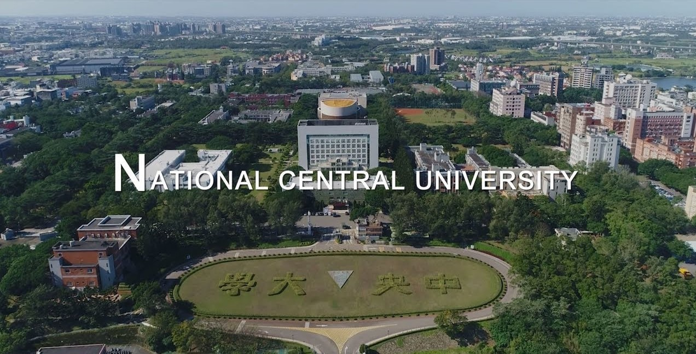
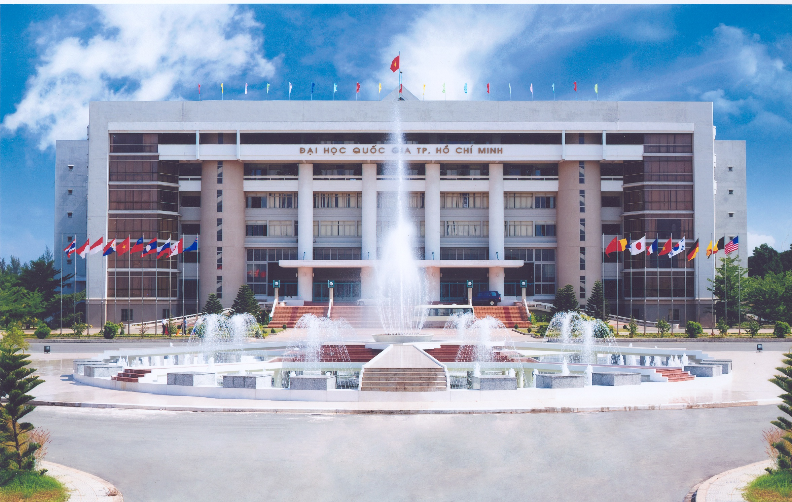

# “Education is the most powerful weapon which you can use to change the world” – Nelson Mandela

## Pursuing Ph.D. in Computer Science.  

### National Central University Taiwan

Since September 9/2020, my academic career in Ph.D. research is one of the most important steps for my academic career. My engagement in National Central University’s tech & innovation initiative exercise my creative, my patience, sparked my obsession with design, and strengthened my tolerance to adversity. 
NCU showed me how much what I love to do, what I passionate about, and surrounded me with a wealth of inspiring peers. 

## M.S Information Technology Application, earned July/2020
### National Central University Taiwan

I’m grateful for these two years away from home, I learned how to articulate my ideas, and discipline myself, and express my thinking and solution for developing and design application that impacts many other people. This time also taught me how much importance of math, physics, and computer science foundation knowledge. One of the most important of my life these two years was a great moment for me working as a team with many excellent and diverse friends from different countries.

## B.S  in Earth Science, earned July/2017
### Vietnam National University, Ho Chi Minh City 

During these four years in The Earth and Planetary Sciences field, I learned how to investigate and gain my experience in encompasses a broad range of science disciplines and applications to environmental and economic endeavors. I’m was lucky to involve in the development and application of new tools and technologies such as space probes and sophisticated instruments, as well as fieldwork in remote and challenging settings. In an unparalleled research environment and monitoring environment.

